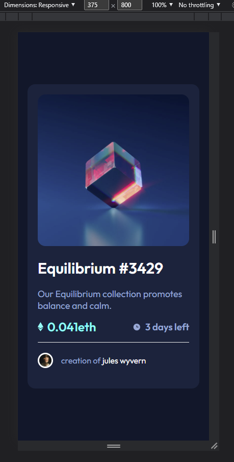
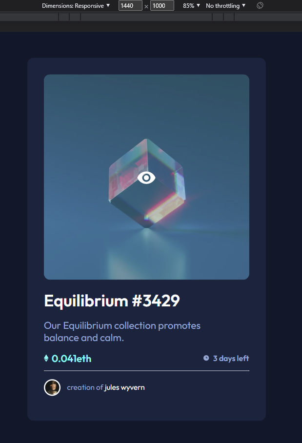

# Make It Real - NFT preview card

This is a solution to the NFT preview card component project of the Make It Real course.

## Table of contents

- [Overview](#overview)
  - [The challenge](#the-challenge)
  - [Screenshot](#screenshot)
- [My process](#my-process)
  - [Built with](#built-with)
  - [What I learned](#what-i-learned)
  - [Continued development](#continued-development)
  - [Useful resources](#useful-resources)
- [Author](#author)
- [Acknowledgments](#acknowledgments)


## Overview

### The challenge

Users should be able to:

- Visualize the card component in desktop a mobile resolution properly

### Screenshot




## My process

### Built with

- HTML5
- CSS
- Flexbox
- Mobile-first workflow

### What I learned

In this project we learn how to overlay images and how to make hover effects.

```css
.wrapper{
    position: relative;
}

.image{
    border-radius: 15px;
    width: 100%;
    height: auto;
}

.hide {
    display: none;
    position: absolute;  
    left: 50%;
    top: 50%;                         
    transform: translate(-50%, -50%); 
}

.image:hover + .hide{
    display: block;
}

.image:hover{
    filter: opacity(0.6) drop-shadow(0 0 0 var(--cyan));
}
```


### Continued development

We need to continue learning about how to CSS effects works.

### Useful resources

- [Resource 1](https://www.w3schools.com/howto/howto_css_display_element_hover.asp) - This helped me to display hover images.

## Author

- Juan Sebastián Muñoz


## Acknowledgments

Thanks to Diana Quinche and Germán.